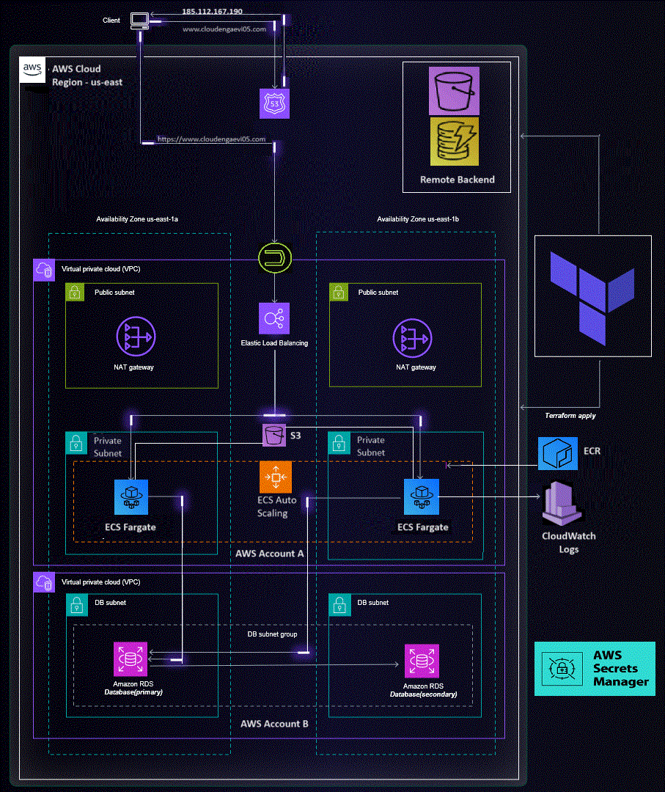

# Cloudeng-aevi-terraform-ECS-project
A set of Terraform templates used for provisioning a multi-tier Dockerized API service stacks on AWS ECS Fargate.

**A high-level architecture diagram of the project**


In this project, terraform templates have been created to design and implement a secure and scalable infrastructure to expose a Dockerized API service.

The API service runs on port 80 (HTTP) within the container, but the public endpoint utilizes HTTPS (port 443). AWS Application Load Balancer (ALB) has been used which recieves the internet traffic on port 443, and route it to the API service running as container inside ECS cluster.

The service is utilizing an S3 service in read-only mode, to retrieve files from S3 Bucket
The service is utilizing an RDS DB service, which is in a separate cluster in another account, for both reading and writing (both read and write access). AWS VPC Peering service has been used, along with proper IAM execution role and policies for ECS task, for cross-account VPC connection.

Also, as a bonus, the project includes a solution which manages the application's logging messages ('non-frequent short INFO messages' and 'frequent long DEBUG messages'). It utilizes CloudWatch Log Groups, CloudWatch Log Metrics and Subscription filters for INFO and DEBUG messages. Its using two Lambda functions, with propser IAM roles/policies:
1. info_processor --> for processing INFO messages for easy and frequent access
2. debug_processor --> for processing DEBUG messages to store in S3 bucket

The python scripts for both the lambda functions are saved in the same project directory.

**NOTE:** The templates are used for managing infrastructure concerns only, and not for managing application concerns like deploying the actual application images and environment variables on top of this infrastructure.


## **Components**

**remote-state_resources**

The components to store and lock terraform statefile

| Name | Description | Optional |
|------|-------------|:---:|
| [backend-resources.tf] | S3 bucket to store and DynamoDB table to lock terraform state  | Yes |


**main_resources**

The components to implement the multi-tier app stacks

| Name | Description | Optional |
|------|-------------|:----:|
| [providers.tf] | Terrform remote backend state, AWS provider |  |
| [ecs.tf] | ECS Cluster, Service, Task Definition, Auto-scaling group, CloudWatch Log Group |  |
| [alb.tf] | ALB, Target Group |  |
| [acm.tf] | A public SSL certificate request from acm |  |
| [variables.tf]| Variables | Yes |
| [vpc.tf] | VPC, public and private subnets, route tables, IGW, NAT gateway |  |
| [rds.tf] | cross-account RDS instance using an existing DB snapshot  | Yes |
| [ecs-role.tf] | IAM role and policies for ECS task execution  |  |
| [s3.tf] | S3 Bucket | Yes |
| [route53.tf] | NS Records set | Yes |
| [outputs.tf] | Get website url to access the dockerized app service | Yes |
| [logs.tf] | CloudWatch Log Groups, Log Metrics, Subscription filters for log messages | Yes |
| [secretsmanager.tf] | Add a Secrets Manager secret, Gives app role and ECS task definition role access to read secrets from Secrets Manager | Yes |
| [lambda.tf] | Lambda functions, IAM roles/policies to access/filter cloudwatch logs | Yes |
| [peering.tf] | Connect cross-account VPCs | Yes |


## **Assumptions**

Following assumptions or arbitrary values have been used to avoid any cost, and considering that things like IAM, monitoring, security scanning and so on are taken care of at an Organisation level.

1. **Domain name**: an arbitrary value to request a public SSL certificate from acm
2. **Certificate arn**: assuming that a valid SSL certificate arn is being generated
3. **db snapshot**: assuming we have a database snapshot from an existing DB in the AWS account B
4. **container image**: an arbitrary Image URI, assuming thers is such an image stored in an ECR repo
5. **secrets**: arbitrary named profile used for each AWS accounts, secretsmanager.tf file is blank, assuming such securities and secrecies being taken care of at an Organisation level


## **Instructions to deploy the solution to a fresh AWS account**

Before deploying the solution on a fresh AWS account, take care of the assumptions, as mentioned above.
Also, the templates are designed to be customized, and the optional components, as mentioned above, can be replaced or tweaked as per specific project requirements.

Also, note that the terraform configuration for backend-resources are in a different sub-folders, and it must be run before the main terraform configuration files are run, to create the remote backend resources first, and then configure it later.
Keeping these points in mind, follow the instructions to deploy the solution:

```
# Move into the backend resource directory
$ cd remote-state_resources

# Sets up Terraform to run
$ terraform init

# format and validate the terraform configuration
$ terraform fmt
$ terraform validate

# Executes the Terraform run
$ terraform apply

# Now, move into the main resources environment
$ cd ../main_resources

# Sets up Terraform to run
$ terraform init

# format and validate the terraform configuration
$ terraform fmt
$ terraform validate

# Executes the Terraform run
$ terraform apply
```

## **Future Considerations/Enhancements**

1. deploy ELK stack and utilize its advanced machine learning based anomaly detection features for better log management
